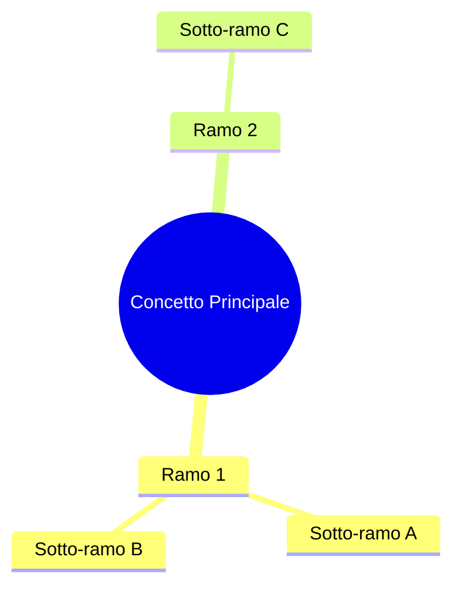
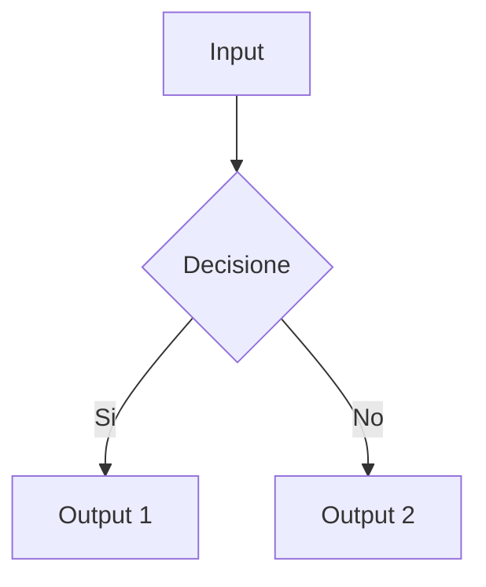
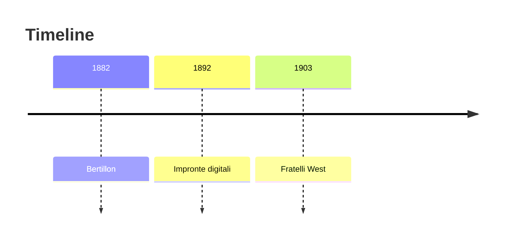
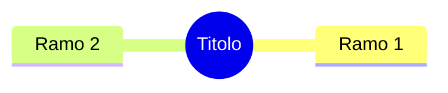

# CLAUDE.md - Linee Guida Appunti Visione Artificiale

Questo file contiene le linee guida per mantenere coerenza e qualità negli appunti del corso di Visione Artificiale.

---

## Regole Fondamentali

### NO EMOJI
**NON utilizzare emoji o faccine di nessun tipo.**
- No: "Lezione 00: Introduzione al Corso"
- Si: "Lezione 00: Introduzione al Corso"

Usa solo testo puro per titoli e descrizioni.

### Lingua
- Italiano (standard universitario)
- Termini tecnici in inglese quando necessario
- Mantieni coerenza terminologica all'interno e tra lezioni

### Stile Professionale
- Tono accademico ma accessibile
- Frasi concise e ben strutturate
- Evita colloquialismi
- Usa la forma passiva quando appropriato per tono neutro

---

## Struttura di una Lezione

Ogni lezione segue questa struttura RIGOROSA:

### 1. Front Matter YAML (obbligatorio)

```yaml
---
layout: default
title: Lezione NN - Titolo Lezione
parent: Lezioni
nav_order: N
has_children: false
description: "Breve descrizione (max 80 caratteri) della lezione"
---
```

**Regole front matter:**
- `nav_order`: numero sequenziale (1, 2, 3, ...)
- `description`: deve essere concisa (usata da search engine)
- Non aggiungere campi extra non necessari

### 2. Titolo Principale

```markdown
# Lezione NN: Titolo Completo della Lezione
```

Una sola h1 per file. Usare h2 per sezioni principali.

### 3. Metadata Lezione (sotto il titolo)

```markdown
Docente: Prof. Annalisa Franco, UniBo
Argomenti: Lista degli argomenti principali separati da virgola
```

### 4. Struttura Interna della Lezione

Segui SEMPRE questo ordine:

1. **Overview** (h2)
   - Elenco puntato di 3-5 concetti principali della lezione
   - Cosa scoprirà lo studente

2. **Sezioni Contenuto** (h2 per ogni grande argomento)
   - h3 per sottosezioni
   - h4 solo se davvero necessario

3. **Diagrammi Mermaid** (incorporati nelle sezioni rilevanti)
   - Min 1-2 per lezione
   - Posizionati dopo il paragrafo che li spiega

4. **Tabelle** (dove appropriato)
   - Comparazioni
   - Elenchi strutturati

5. **Glossario/Flashcard** (h2)
   - Tabella con colonne: Termine | Definizione | (Esempio opzionale)
   - Min 8-10 termini per lezione

6. **Domande Tipiche d'Esame** (h2)
   - Q: Domanda in grassetto
   - A: Risposta sintetica in paragrafo
   - Min 3-5 domande per lezione

7. **Riferimenti e Risorse** (h2)
   - Testi di riferimento (con autore, titolo, editore, anno)
   - Riviste scientifiche
   - Link esterni (solo affidabili)

8. **Prossima Lezione** (ultima riga)
   - Link a lezione successiva se disponibile

---

## Convenzioni Markdown

### Titoli
```markdown
# Titolo Principale (una sola per file)
## Sezione Principale
### Sottosezione
#### Sub-sottosezione (raro)
```

### Enfasi
```markdown
**grassetto** per concetti importanti
*corsivo* per termini in lingua straniera
`codice` per variabili, funzioni, comandi
```

### Liste
```markdown
- Elemento lista non ordinata
  - Sottoelemento (2 spazi)
    - Sub-sottoelemento

1. Elemento lista ordinata
2. Secondo elemento
```

### Blockquote (per note/avvertenze)
```markdown
> Nota importante: testo della nota
```

### Codice
```markdown
Inline: `codice inline`

Blocco:
```python
def esempio():
    return True
```
```

Linguaggi supportati: python, javascript, java, cpp, matlab

---

## Diagrammi Mermaid

### Supportati e Consigliati

**Mindmap** - Per concetti interconnessi
```markdown

```

**Flowchart** - Per processi e algoritmi
```markdown

```

**Timeline** - Per storia/evoluzione
```markdown

```

### Regole Mermaid
- Posizionare subito dopo il paragrafo di introduzione
- Non mettere titoli sopra (usare testo esplicativo nel paragrafo)
- Massimo 1-2 per sezione (non sovraccaricare)
- Nomi in inglese se già standard (es: "Pattern Recognition", non "Riconoscimento di Pattern")

---

## Tabelle

### Formato Standard
```markdown
| Colonna 1 | Colonna 2 | Colonna 3 |
|-----------|-----------|-----------|
| Dato A    | Dato B    | Dato C    |
| Dato D    | Dato E    | Dato F    |
```

### Tabelle Comparazione (molto usate)
```markdown
| Aspetto | Opzione A | Opzione B |
|---------|-----------|-----------|
| **Velocita** | Rapido | Lento |
| **Affidabilita** | Alta | Bassa |
```

### Glossario (tabella speciale)
```markdown
| Termine | Definizione | Esempio (opzionale) |
|---------|-------------|---------------------|
| **Termine 1** | Spiegazione concisa | Caso d'uso |
```

---

## Nomenclatura File e Cartelle

### Cartelle Lezioni
```
docs/lezioni/NN-titolo-kebab-case/
  └── index.md
```

Esempi corretti:
- `docs/lezioni/00-introduzione/`
- `docs/lezioni/01-sistemi-visione/`
- `docs/lezioni/02-immagini-digitali/`
- `docs/lezioni/03-segmentazione/`

**Regole:**
- Usa numero lezione con zero-padding (00, 01, 02, ...)
- Titolo in kebab-case (minuscolo con trattini)
- File deve essere `index.md`
- NON usare spazi o underscore nei nomi cartelle

---

## Contenuto Minimo per Lezione

Ogni lezione DEVE contenere:

- [ ] Front matter YAML completo e corretto
- [ ] Titolo h1 unico
- [ ] Metadata (Docente, Argomenti)
- [ ] Sezione Overview con 3-5 punti
- [ ] Almeno 2 sezioni di contenuto principale (h2)
- [ ] Almeno 1-2 diagrammi Mermaid
- [ ] Almeno 1 tabella
- [ ] Almeno 8 termini nel Glossario
- [ ] Almeno 3-5 Domande d'Esame
- [ ] Sezione Riferimenti e Risorse
- [ ] Lunghezza: 400-800 righe (lezione media)

---

## Lunghezza e Livello di Dettaglio

### Per Lezione Media (Introduzione, Concetti Base)
- 400-600 righe di markdown
- 4-5 sezioni principali (h2)
- 1-2 diagrammi Mermaid
- 1-2 tabelle

### Per Lezione Complessa (Algoritmi, Metodologie)
- 600-800 righe di markdown
- 5-7 sezioni principali
- 2-3 diagrammi Mermaid
- 2-3 tabelle

### Equilibrio
Non fare lezioni troppo lunghe (>1000 righe) o troppo corte (<300 righe).
Se una lezione supera 800 righe, considera di dividerla in due.

---

## Citazioni e Riferimenti

### Formato Testi
```
Autore(i): *Titolo del Libro*, Editore, Anno
Esempio: Forsyth, Ponce: *Computer Vision: A Modern Approach*, Pearson 2012
```

### Riviste Scientifiche
```
IEEE Transactions on Pattern Analysis and Machine Intelligence
Pattern Recognition
Pattern Recognition Letters
International Journal of Computer Vision
```

### Link Esterni
- Solo link verificati e stabili
- Preferire siti .edu, .org, siti ufficiali
- Aggiungere brief description se non ovvio
- Formato: `[Testo Link](URL)`

Esempio:
```markdown
[BIOLAB - University of Bologna](http://biolab.csr.unibo.it/)
[IEEE Xplore Digital Library](https://ieeexplore.ieee.org/)
```

---

## Consistenza Terminologica

### Termini Standardizzati (usare SEMPRE così)

| Termine | Forma Corretta | NO |
|---------|---|---|
| Visione Artificiale | Visione Artificiale | VA (abbreviazione rara) |
| Pattern Recognition | Pattern Recognition | Riconoscimento di Pattern |
| Feature | Feature (inglese) | Caratteristica (raramente) |
| Segmentazione | Segmentazione | Segmentazione immagine |
| Template Matching | Template Matching | Confronto template |
| Deep Learning | Deep Learning | Apprendimento profondo (raramente) |
| SLAM | SLAM | Localizzazione e Mapping |
| CNN | CNN (se gia' noto) | Rete neurale convoluzionale |

---

## Tone of Voice

### DO
- Professionale e accademico
- Chiaro e diretto
- Educativo senza essere didattico/condiscendente
- Scientifico ma accessibile

### DON'T
- Colloquiale ("Allora ragazzi...")
- Troppo informale ("tipo", "infatti")
- Opinioni personali ("penso che...")
- Slang o gergo

### Esempi

**BUONO:** "La Visione Artificiale affronta il problema di estrarre informazioni significative da immagini digitali."

**CATTIVO:** "Allora, praticamente la VA e' quando il computer guarda le foto, tipo."

---

## Processo di Aggiunta Lezione

1. Leggi completamente il PDF della lezione
2. Estrai i concetti principali e crea un outline
3. Crea cartella: `docs/lezioni/NN-titolo/`
4. Crea `index.md` con front matter
5. Scrivi contenuto seguendo struttura sopra
6. Aggiungi almeno 1-2 diagrammi Mermaid
7. Crea glossario/flashcard
8. Scrivi 3-5 domande d'esame
9. Aggiungi riferimenti
10. Verifica NO EMOJI
11. Git commit: `Add Lesson NN: Titolo`
12. Verifica renderizzazione locale con Jekyll

---

## Jekyll e Build

### Comandi Locali
```bash
cd C:\UNI\Magistrale\visione
bundle install  # Prima volta
bundle exec jekyll serve  # Avvia server locale
# Visita http://localhost:4000/visione_appunti/
```

### Front Matter Validazione
Jekyll richiede YAML valido. Usa 2 spazi per indentazione, non tab.

### Build Locale Prima di Push
Sempre testare localmente:
```bash
bundle exec jekyll build
# Verifica che _site/ sia generato senza errori
```

---

## Git Workflow

### Commit per Lezione Nuova
```bash
git add docs/lezioni/NN-titolo/
git commit -m "Add Lesson NN: Titolo Lezione"
git push origin main
```

### Commit per Modifica
```bash
git add docs/lezioni/NN-titolo/index.md
git commit -m "Update Lesson NN: specifica della modifica"
git push origin main
```

### Messaggi Commit
- "Add Lesson NN: ..." per nuove lezioni
- "Update Lesson NN: ..." per modifiche
- "Fix Lesson NN: ..." per correzioni bug
- Mai usare "Fixed typo" come messaggio principale

---

## Qualita e Revisione

### Checklist Prima di Ogni Commit

- [ ] NO EMOJI in alcun punto del file
- [ ] Front matter YAML valido e completo
- [ ] Una sola h1 nel file
- [ ] Headings in ordine (h1 > h2 > h3)
- [ ] Tabelle formattate correttamente
- [ ] Mermaid diagrammi valid (testato rendering locale)
- [ ] Link funzionanti e verificati
- [ ] Nessuna typo o errore ortografico
- [ ] Glossario con almeno 8 termini
- [ ] Almeno 3 domande d'esame
- [ ] Sezione Riferimenti completa
- [ ] File compila senza warning in Jekyll

### Spelling
- Italiano: correttore automatico (VS Code: Language Extensions)
- Termini tecnici inglesi: verificare spelling
- Accenti: sempre usarli correttamente (è, à, ò, etc.)

---

## Struttura Index Gerarchica

### Index Principale (docs/index.md)
- Homepage del corso
- NO sezioni lezioni (quelle vanno in docs/lezioni/index.md)

### Index Lezioni (docs/lezioni/index.md)
- Parent per tutte le lezioni
- Brief description del corso
- NO singole lezioni qui

### Singole Lezioni (docs/lezioni/NN-titolo/index.md)
- Contenuto full della lezione
- parent: Lezioni
- nav_order: numero sequenziale

---

## Migliori Pratiche Markdown

### Usa Heading Hierarchy
```markdown
# (una sola h1, il titolo della lezione)
## Sezione principale
### Sottosezione
#### Dettagli (raro)
```

### Spazi Bianchi
- Una linea vuota tra sezioni
- Una linea vuota prima e dopo tabelle/diagrammi
- Nessuna linea vuota dentro liste (mantieni compatte)

### Nesting Lists
```markdown
- Elemento principale
  - Sub-elemento (2 spazi)
    - Sub-sub-elemento (4 spazi)
```

### Code Blocks
- Per linguaggi: specificare il linguaggio (```python, ```javascript, etc.)
- Per pseudocodice: usare ```text
- Inline code per variabili singole

---

## Riferimento Veloce

```markdown
---
layout: default
title: Lezione NN - Titolo
parent: Lezioni
nav_order: N
has_children: false
description: "Breve descrizione della lezione (max 80 char)"
---

# Lezione NN: Titolo Completo

Docente: Prof. Annalisa Franco, UniBo
Argomenti: Arg1, Arg2, Arg3

## Overview

- Punto 1
- Punto 2
- Punto 3

## Sezione Principale 1

Contenuto della sezione...



## Sezione Principale 2

Contenuto...

| Colonna | Colonna |
|---------|---------|
| Dato    | Dato    |

## Glossario

| Termine | Definizione |
|---------|-------------|
| **T1**  | Def 1       |

## Domande d'Esame

**Q: Domanda?**
A: Risposta sintetica.

## Riferimenti

- Autore: *Titolo*, Editore 2020

---

Prossima lezione: Lezione NN+1
```

---

## Contatti e Domande

Per dubbi su stile e coerenza:
- Consulta questo file CLAUDE.md
- Verifica lezioni gia' scritte come reference
- Assicurati di seguire la struttura e le regole

---

**Ultimo aggiornamento:** Marzo 2025
**Creato per:** Corso Visione Artificiale - UniBo
**Responsabile:** Prof. Annalisa Franco
