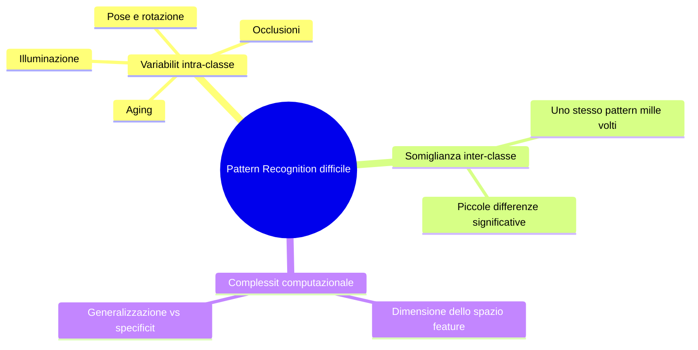

# Lezione 00: Introduzione al Corso

**Docente:** Prof. Annalisa Franco, UniBo
**Argomenti:** Fondamenti di Visione Artificiale e Pattern Recognition

---

## Overview

In questa lezione introduttiva scopriamo:
- Cos' la **Visione Artificiale** e perch  difficile
- Le principali **applicazioni industriali** (automotive, biometria, SLAM, ecc.)
- La **storia della biometria** (Bertillon  impronte digitali)
- I **4 approcci fondamentali** al Pattern Recognition
- **Problematiche pratiche** (makeup, illuminazione, aging, occlusions)

---

## 1 Fondamenti di Visione Artificiale e Pattern Recognition

### Definizioni Base

**Visione Artificiale (VA):** Insieme di tecniche e algoritmi per acquisire, processare e analizzare immagini e video per estrarre informazioni significative dal mondo fisico.

**Pattern Recognition (PR):** Disciplina che mira a **classificare** oggetti/entit in categorie sulla base di caratteristiche misurate (feature).

### Perch il PR  difficile?

### Human vs Mechanical PR

| Aspetto | Umano | Meccanico |
|---------|-------|----------|
| **Velocit** | Rapido | Lento (inizialmente) |
| **Affidabilit** | Variabile (stanchezza) | Consistente |
| **Apprendimento** | Intuitivo e veloce | Richiede dataset ampi |
| **Generalizzazione** | Eccellente su varianti nuove | Limitato a training data |

---

## 2 Applicazioni della Visione Artificiale

###  Video-based Interaction / Gaming
- Kinect, sensori depth
- Gesture recognition in real-time
- Controller-free gaming

###  Automotive
**"Explosive Growth of Computer Vision in Cars"**
- Parking Assist: telecamera posteriore
- Safety Systems: rilevamento pedoni
- Autonomous Driving: multi-camera fusion
- Applications: rear-view, lane detection, driver monitoring

###  Ambient Assisted Living
- Monitoraggio anziani nelle abitazioni
- Fall detection (rilevamento cadute)
- Analisi della postura e movimenti

###  Supermercati/Acquisiti
- Localization: Bag of visual words
- Conteggio automatico merci
- Riconoscimento prodotto

###  SLAM (Simultaneous Localization and Mapping)
- **Robotica:** navigazione autonoma
- **Submarina:** esplorazione fondali
- **Droni:** UAV e ricognizione
- **Spaziale:** rover lunari

###  Applicazioni Industriali

| Area | Applicazione | Tecniche |
|------|-------------|----------|
| **Ispezione Visuale** | Difetti su linea produzione | Segmentazione, classificazione |
| **Calibrazione** | Allineamento componenti | Feature matching |
| **Rilevamento Difetti** | Qualit prodotto | Threshold, morphological ops |
| **Conteggio** | Dimensioni oggetti | Contornatura, metriche |
| **SLAM** | Navigazione robot | Feature matching, 3D reconstruction |

###  Face Detection e Recognition
- **Rilevamento:** localizzazione volti in immagini
- **Riconoscimento:** identificazione identit
- **Emozioni:** analisi espressioni (Disgust, Surprise, Sad, Angry, Fear, Happy, Contempt, Neutral)

---

## 3 Riconoscimento Biometrico

### Definizione
Il **riconoscimento biometrico** utilizza caratteristiche **fisiologiche** (impronta, iride, viso) o **comportamentali** (firma, andatura) per identificare una persona.

### Caratteristiche

**Fisiologiche:**
- Impronta digitale
- Iride/Retina
- Viso (facial features)
- DNA

**Comportamentali:**
- Firma
- Andatura (gait)
- Voce
- Modo di digitazione (keystroke)

### Una biometria  valida se:
- **Universale:** presente in tutti
- **Permanente:** non cambia nel tempo
- **Unica:** consente di distinguere individui
- **Misurabile:** quantificabile da sensori

---

## 4 Storia della Biometria

###  Il Sistema di Bertillon (1882)

**Alphonse Bertillon** propose il primo sistema sistematico per identificare criminali:
- **Bertillonage:** misure antropometriche (altezza, lunghezza braccia, piedi, dita)
- **Fotografie:** fronte e profilo
- **Archivi:** organizzazione per categorie di misure

**Limite:** Due persone con stesse misure? Sistema inaffidabile.

###  Impronte Digitali (1892+)

**Galton e Faulds** scoprirono: **nessuna due persone hanno impronte identiche**.

**Vantaggi sulle misure Bertillon:**
-  Universali (quasi tutti le hanno)
-  Permanenti (non cambiano)
-  Uniche (probabilit match ~1 su miliardi)
-  Facili da acquisire

###  Il Caso dei Fratelli West (1903)

Will West, condannato per crimine minore nel 1903, fu riconosciuto essere gi in prigione per omicidio. Le **impronte digitali** confermarono l'identit diversa dalle misure Bertillon  dimostrando la superiorit delle impronte.

---

## 5 Problematiche nel Riconoscimento Facciale

### Fattori di Variabilit
- **Makeup:** cambia completamente l'aspetto
- **Illuminazione:** ombre, glare, variabilit direzionale
- **Aging:** cambiamenti fisiologici nel tempo
- **Occlusion:** occhiali, maschere, capelli

### Bassa Resistenza agli Attacchi
- **Morphed Faces:** visi sintetici che blendano due identit
- **Presentational Attacks:** foto, maschere 3D
- **Age Progression:** invecchiamento artificiale

### "The Magic Passport" (Ferrara, Franco, Maltoni)
Caso di studio: criminale tenta di cambiare identit con passaporto morphed.

---

## 6 I 4 Principali Approcci al Pattern Recognition

### 1 Template Matching

**Idea:** Confrontare il pattern con template modello memorizzati.

**Processo:**
1. Acquisire template di riferimento
2. Per ogni posizione nell'immagine, calcolare similarit
3. Trovare massimo matching

**Limitazioni:** Sensibile a traslazioni, rotazioni, variabilit intra-classe.

### 2 Approccio Statistico

**Idea:** Rappresentare pattern come punto nello spazio feature multidimensionale.

**Fasi:**
1. **Estrazione feature:** mappare pattern  vettore numerico
2. **Classificazione:** associare classe (es. minima distanza euclidea)

**Classificatori:** SVM, Naive Bayes, Decision Trees

### 3 Approccio Strutturale

**Idea:** Codificare pattern con componenti primitive e relazioni strutturali.

**Processo:**
1. Identificare primitive (elementi base)
2. Definire relazioni strutturali
3. Costruire grafo relazionale
4. Matching di grafi

### 4 Reti Neurali

**Idea:** Simulare reti biologiche per apprendere mapping non-lineari complessi.

**Caratteristiche:**
- Composte da **neuroni** interconnessi
- Apprendimento tramite **backpropagation**
- Mapping **appreso da dati**, non hand-crafted

**Rivoluzione:** Le reti profonde (Deep Learning) hanno superato i metodi tradizionali!

---

##  Programma del Corso

### Parte 1: Fondamenti Immagine e Feature
- Elaborazione immagini e filtraggio digitale
- Estrazione feature: Handcrafted vs Representation learning
- Segmentazione (Mean Shift, color analysis)
- Feature di colore, tessitura, forma

### Parte 2: Segmentazione Semantica e Feature Locali
- Deep learning per segmentazione semantica
- Image stitching e registrazione 2D
- Keypoint e descriptori locali (SIFT, SURF, BRIEF)
- SLAM per robotica

### Parte 3: Recognition "in the Wild"
- Content-based image retrieval (Bag of Visual Words)
- Deep learning per localizzazione/riconoscimento
- Video analysis: tracking, crowd analysis

---

##  Domande Tipiche d'Esame

**Q: Quali sono i 4 approcci principali al Pattern Recognition?**

A: Template Matching, Statistico, Strutturale, Reti Neurali. Ognuno ha trade-off fra semplicit e robustezza. I moderni sistemi usano Deep Learning per migliori performance.

**Q: Perch il riconoscimento facciale  difficile?**

A: Variabilit intra-classe (makeup, illuminazione, aging, occlusions) e somiglianza inter-classe (due persone diverse ma simili). Un viso  soggetto a infinite variazioni.

**Q: Che cos' una biometria valida?**

A: Deve essere universale, permanente, unica, e misurabile. L'impronta digitale  migliore di Bertillon per questi criteri.

**Q: Qual  il vantaggio di Reti Neurali rispetto ai metodi tradizionali?**

A: Apprendono mapping non-lineari complessi direttamente dai dati, senza feature engineering manuale. Le reti profonde hanno superato metodi tradizionali in vision.

**Q: Che cosa  SLAM?**

A: Simultaneous Localization and Mapping. Un robot/drone naviga un ambiente sconosciuto mentre contemporaneamente crea una mappa usando visione artificiale.

---

##  Glossario Flashcard

| Termine | Definizione |
|---------|-------------|
| **Visione Artificiale** | Acquisizione e analisi di immagini per estrarre informazioni |
| **Pattern Recognition** | Classificazione di oggetti in categorie basata su feature |
| **Feature** | Misura numerica di una propriet del pattern |
| **Template Matching** | Confronto pattern con modelli memorizzati |
| **Classificatore** | Algoritmo che assegna classe a un pattern (SVM, NN) |
| **Biometria** | Caratteristica fisiologica/comportamentale per identificazione |
| **SLAM** | Localizzazione e mapping simultaneo |
| **Segmentazione** | Divisione immagine in regioni omogenee |
| **Deep Learning** | Reti neurali profonde con molteplici layer |
| **Bertillon** | Primo sistema sistematico per identificare criminali (1882) |

---

##  Riferimenti e Risorse

### Testi di Riferimento
- Zhang, Lipton, Li, Smola: *Dive into Deep Learning* (d2l.ai, 2020)
- Elgendy: *Deep Learning for Vision Systems* (Manning, 2020)
- Forsyth, Ponce: *Computer Vision a Modern Approach* (Pearson, 2012)
- Kaehler, Bradski: *Learning OpenCV 3* (O'Reilly, 2017)
- Gonzalez, Woods: *Elaborazioni delle Immagini Digitali* (Prentice Hall, 2008)

### Riviste Scientifiche
- IEEE Transactions on Pattern Analysis and Machine Intelligence
- Pattern Recognition
- Pattern Recognition Letters

### Risorse Online
- Computer Vision Homepage: http://www.cs.cmu.edu/~cil/vision.html
- IAPR (International Association for Pattern Recognition): http://www.iapr.org/
- BIOLAB: http://biolab.csr.unibo.it/

---

**Prossima lezione:** Lezione 01 - Sistemi di Visione (acquisizione immagini, fotocamere)
