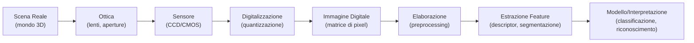

# Lezione 01: Sistemi di Visione

**Docente:** Prof. Annalisa Franco, UniBo
**Argomenti:** Architettura e componenti dei sistemi di visione artificiale

---

## Overview

In questa lezione esaminiamo i fondamenti tecnici dei sistemi di visione artificiale:

- L'architettura di base: dall'acquisizione fisica alla rappresentazione digitale
- Principi di ottica geometrica e formazione dell'immagine
- Sensori digitali (CCD, CMOS) e tecnologie di acquisizione
- Parametri fondamentali (field of view, depth of field, resoluzione, distorsione)
- Sistemi di illuminazione per diverse applicazioni
- Tecnologie di acquisizione 3D (stereo, structured-light, ToF, Kinect)

---

## 1 Architettura di un Sistema di Visione

### Flusso Dati Generale



### Componenti Fondamentali

| Componente | Funzione | Note |
|-----------|----------|------|
| **Ottica (lenti)** | Focalizzare la luce sulla scena verso il sensore | Determina FOV, profondità di campo, distorsione |
| **Sensore** | Convertire fotoni in segnale elettrico | CCD/CMOS con filtri di colore (Bayer) |
| **Digitalizzatore** | Campionare e quantizzare il segnale analogico | Determina risoluzione spaziale e radiometrica |
| **Interfaccia** | Trasferire dati al calcolatore | USB, GigaE, firewire |
| **Illuminazione** | Fornire luce alla scena | Critica per qualità dell'acquisizione |

---

## 2 Formazione dell'Immagine e Ottica Geometrica

### Dal Mondo Reale all'Immagine Digitale

Un sistema di visione è un **proiettore da 3D a 2D**:
- **Input:** scena tridimensionale (infiniti punti nello spazio)
- **Output:** immagine bidimensionale (matrice finita di pixel)
- **Perdita di informazione:** la dimensione di profondità collassa in 2D

### La Camera Obscura (4° secolo a.C.)

Il principio più antico di formazione dell'immagine:
- **Principio:** luce passa attraverso un piccolo foro in una camera sigillata
- **Risultato:** immagine reale, capovolta, proiettata su schermo
- **Limite:** quantità minima di luce, lunga esposizione

```
Scena esterna --> [foro piccolo] --> Immagine capovolta su parete
```

### Pinhole Camera (Modello Semplificato)

La **pinhole camera** è il modello geometrico più semplice:

```
Punto 3D (X, Y, Z) --> [Centro ottico] --> Pixel (x, y) su immagine
```

**Equazioni di proiezione prospettica:**
- x = f * X / Z
- y = f * Y / Z

Dove:
- (X, Y, Z): coordinate del punto 3D nel sistema della camera
- (x, y): coordinate del pixel nell'immagine
- f: distanza focale (in pixel)
- Z: profondità (distanza del punto dal piano della camera)

**Proprietà:**
- Punti distanti (Z grande) si proiettano vicini all'asse ottico
- Linee parallele nel 3D convergono in un punto (punto di fuga)
- La visione è prospettica, non ortogonale

---

## 3 Lenti Sottili e Formazione Reale dell'Immagine

### L'Equazione della Lente Sottile

Una lente sottile ideale è descritta da:

**1/f = 1/z + 1/z'**

Dove:
- **f:** distanza focale (proprietà della lente)
- **z:** distanza dell'oggetto dalla lente (working distance)
- **z':** distanza dell'immagine dalla lente (distanza del sensore)

### Fattore di Ingrandimento

**M = z' / z = y' / y**

Dove:
- M: rapporto di ingrandimento (magnification factor)
- y: altezza dell'oggetto
- y': altezza dell'immagine proiettata sul sensore

**Implicazioni:**
- Se M > 1: immagine ingrandita (macro photography)
- Se M = 1: ingrandimento unitario (proiezione naturale)
- Se M < 1: immagine rimpicciolita

### Messa a Fuoco

**Condizione di focus:** l'immagine è a fuoco quando la distanza dell'immagine z' soddisfa l'equazione della lente.

**Regolazione del fuoco:**
- Spostare la lente (cambio di z')
- Cambio della distanza dell'oggetto (cambio di z)
- Cambio della distanza focale f (zoom ottico)

---

## 4 Parametri Fondamentali dei Sistemi di Visione

### 4.1 Field of View (FOV)

Il **field of view** è l'angolo di visione di una telecamera.

**Angolo orizzontale (FOVh):**
```
FOVh = 2 * arctan(W / (2*f))
```

Dove:
- W: larghezza del sensore (mm)
- f: distanza focale (mm)

**Relazione:**
- **f piccola (wide angle):** FOV grande (grandangolo, ~100-180°)
- **f grande (telephoto):** FOV piccolo (zoom, ~10-30°)

**Working Distance:**
- Minima distanza utile di focus dalla lente
- Dipende da f e dall'intervallo di messa a fuoco (focusing range)

### 4.2 Profondità di Campo (Depth of Field, DoF)

La **profondità di campo** è l'intervallo di distanze in cui l'immagine rimane sufficientemente a fuoco.

**Fattori che influenzano DoF:**

| Fattore | Effetto su DoF |
|---------|---|
| **Apertura (diaframma)** | Apertura piccola → DoF grande |
| **Distanza focale** | f piccola → DoF grande |
| **Distanza dell'oggetto** | Oggetto lontano → DoF grande |
| **Cerchio di confusione** | Limite di tolleranza sulla nitidezza |

**Regola pratica:**
- **Macro (vicino):** DoF molto ridotto, è critico il fuoco
- **Paesaggio (lontano):** DoF grande, tutto è a fuoco
- **Telefoto (f grande):** DoF ridotto anche da lontano

### 4.3 Risoluzione Spaziale

La **risoluzione** è il numero di pixel per unità di lunghezza nella scena.

**Fattori:**
- Numero totale di pixel del sensore (sensor resolution in megapixel)
- Dimensione fisica del sensore (1/2", 1/3", 2/3" etc.)
- Dimensione fisica del pixel (pixel pitch, e.g. 2.2 micrometri)
- FOV (immagine con FOV grande = meno pixel per mm di scena)

**Risoluzione e accuratezza:**
- Oggetti più piccoli di 1-2 pixel non sono distinguibili
- La risoluzione limita il dettaglio massimo misurabile

### 4.4 Distorsione Ottica

La **distorsione** è la deviazione dalla proiezione prospettica ideale (pinhole).

**Tipi principali:**

1. **Distorsione Radiale (Barrel/Pincushion)**
   - Linee rette appaiono curve
   - Barrel: centro amplificato (grandangolo)
   - Pincushion: bordi verso il centro (telephoto)

2. **Distorsione Tangenziale (Decentered)**
   - Dovuta ad asimmetria nella lente
   - Meno comune con lenti di qualità

**Modello di correzione:** i parametri di distorsione sono determinati durante la **calibrazione della camera**.

---

## 5 Sensori e Acquisizione Digitale

### 5.1 Tipi di Sensori: CCD vs CMOS

| Aspetto | CCD | CMOS |
|--------|-----|------|
| **Principio** | Charge-coupled device: trasferimento sequenziale di carica | Complementary Metal-Oxide: pixel indipendenti con transistor |
| **Rumore** | Molto basso (shutter globale) | Più rumore di lettura |
| **Velocita di acquisizione** | Tipicamente slow (24-60 fps) | Veloce (100-1000+ fps) |
| **Consumo energetico** | Moderato | Basso |
| **Costo** | Moderato-alto | Basso |
| **Utilizzo** | Imaging scientifico, fotografia ad alta qualità | Telecamere sorveglianza, smartphone |

**Vantaggio CCD:** qualità superiore, rumore minore
**Vantaggio CMOS:** velocità, basso costo, facile integrazione

### 5.2 Acquisizione del Colore: Pattern di Bayer

La maggior parte dei sensori è **monocromatica** (sensibile a intensità luminosa solo).

Per acquisire il **colore**, si usa il **pattern di Bayer:**
- Griglia di filtri colorati rosso (R), verde (G), blu (B)
- Disposizione: RGGB (50% G, 25% R, 25% B)
- Motivo: l'occhio umano è più sensibile al verde

**Demosaicing:**
- Interpolazione per ricostruire 3 canali RGB da 1 sensore
- Riduce efficacemente risoluzione (il sensore da 12MP produce immagine RGB ~6MP effettiva)

### 5.3 Caratteristiche Radiometriche

| Parametro | Significato |
|-----------|------------|
| **Sensibilità** | Capacità di catturare luce debole (ISO nel fotografico) |
| **Dynamic Range** | Rapporto tra massima e minima intensità misurabile (12-14 bit tipico) |
| **Response Linearita** | Relazione tra fotoni ricevuti e valore di pixel (idealmente lineare) |
| **Shutter Globale/Rolling** | Shutter globale: tutti i pixel catturano simultaneamente; Rolling: riga per riga (può causare distorsioni in movimento) |

---

## 6 Illuminazione

La qualità dell'acquisizione dipende criticamente dall'illuminazione. Diversi scenari richiedono strategie diverse.

### 6.1 Illuminazione di Oggetti Riflettenti (glossy/shiny)

**Superficie brillante:** riflette specularmente (come uno specchio).

**Problemi:**
- Riflessi luminosi (hot spots) saturano il sensore
- Perdita di dettagli sulla superficie
- Shadows profonde

**Strategie di illuminazione:**

1. **Illuminazione diffusa (Softbox/Dome)**
   - Luce distribuita uniformemente
   - Riduce hot spots
   - Mantiene consistenza di illuminazione
   - Pro: elimina riflessi speculari
   - Contro: meno drammatico, meno dettagli di texture

2. **Illuminazione Direzionale (Spot/Strobe)**
   - Luce concentrata da una direzione
   - Illumina uniformemente object
   - Pro: elevato contrasto, dettagli di forma
   - Contro: ombre forti, possibili hot spots

3. **Back-lighting (Controluce)**
   - Luce da dietro l'oggetto
   - Separa l'oggetto dallo sfondo
   - Pro: contorni netti
   - Contro: faccia dell'oggetto in ombra

### 6.2 Illuminazione di Oggetti Non-Riflettenti (matte/opaque)

**Superficie opaca:** riflette diffusamente (Lambertiana).

**Strategie:**

1. **Illuminazione Uniforme (Dome Light)**
   - Distribuzione di luce da tutte le direzioni
   - Pro: illuminazione omogenea, nessun ombra
   - Contro: poco contrasto, mancano dettagli di forma

2. **Illuminazione Strutturata (Direzionale + Riflettore)**
   - Luce principale da una direzione + riflettore per fill-in
   - Pro: contrasto naturale, dettagli di forma e trama
   - Contro: setup più complesso

3. **Illuminazione Coassiale (Coaxial)**
   - Luce passa attraverso lo stesso percorso ottico dell'immagine
   - Elimina le ombre totalmente
   - Pro: nessuna ombra, illuminazione estremamente uniforme
   - Contro: può apparire poco naturale

### 6.3 Scelta dei Colori di Illuminazione

- **Luce Bianca (5000-6500K):** neutrale, simula luce naturale
- **Luce Calda (3000K):** colori rossi, simula tungsteno
- **Luce Fredda (7000K+):** colori blu
- **Illuminazione Monocromatica:** riducono riflessi di colore, utile per materiali metallici

---

## 7 Tecnologie di Acquisizione 3D

### 7.1 Principi Generali

Mentre una singola camera cattura solo 2D (proiezione prospettica), per **ricostruire la profondità** (terza dimensione Z) sono necessarie tecniche speciali:

1. **Stereo:** due camere con baseline nota
2. **Structured-Light:** proiezione di pattern codificato
3. **Time-of-Flight (ToF):** misura del tempo di volo della luce
4. **Photometric Stereo:** variazione dell'illuminazione

### 7.2 Acquisizione Stereo

**Principio:** due camere parallele con **baseline** (distanza) nota.

```
Punto 3D P
        |\
    d   | \  disparità = |x_L - x_R|
        |  \
    [L]-----[R]
    x_L     x_R
```

**Equazione di profondità:**
```
Z = (baseline * f) / disparita
```

Dove:
- baseline: distanza tra i centri ottici delle due camere
- f: distanza focale comune
- disparita: differenza di coordinata x tra le due immagini

**Vantaggi:**
- Geometricamente semplice
- Funziona con illuminazione naturale
- Costo basso (solo 2 camere)

**Svantaggi:**
- Richiede texture nella scena (difficile su superfici lisce)
- Occlusion: aree visibili da una camera ma non dall'altra
- Matching: trovare le corrispondenze è computazionalmente intensivo

### 7.3 Structured-Light

**Principio:** proiettare un **pattern di luce codificato** sulla scena e osservare come si deforma.

**Codifiche comuni:**

| Tipo | Descrizione | Vantaggi | Svantaggi |
|------|------------|----------|-----------|
| **Bande parallele** | Linee parallele alternate | Semplice | Ambiguità con pattern ripetuto |
| **Pattern sinusoidale** | Onde sinusoidali proiettate | Fase continua, precisa | Fase-wrapping |
| **Codice Gray** | Sequenza binaria codificata | Unica assegnazione per pixel | Richiede più frame (24-30) |
| **Colore (RGB)** | Proiezione con 3 colori distinti | Veloce (meno frame) | Sensibile a colori della scena |

**Accuratezza:** dipende dalla densità di pattern proiettato. Pattern fine → alta densità di punti 3D.

**Applicazioni:** scanning 3D industriale, reverse engineering, acquisizione di statue/manufatti.

**Svantaggi:**
- Richiede proiezione attiva (non funziona all'aperto con sole)
- Tempo di acquisizione multipli frame

### 7.4 Time-of-Flight (ToF)

**Principio:** illuminare la scena con luce modulata (IR) e misurare il tempo che impiega la luce a ritornare.

```
Emettitore ToF --[impulso IR]--> Scena --> Sensore
                    tempo di volo = 2 * distanza / c
```

**Equazione di distanza:**
```
Z = (c * tempo_volo) / 2
```

Dove c = 3e8 m/s (velocità della luce).

**Tecnologia:**
- Sensore ToF ha pixel di profondità (depth pixel)
- Ogni pixel misura il ToF indipendentemente
- Output: mappa di profondità allineata spazialmente (non necessita matching come stereo)

**Vantaggi:**
- Veloce (30-60 fps tipico)
- Mappa di profondità densa
- Robusto a texture povere
- Funziona in ambienti scarsamente illuminati

**Svantaggi:**
- Errori sistematici (multipath reflections)
- Alcool, vetro, specchi causano problemi
- Frequenze di luce IR possono interferire (sole, altre sorgenti IR)
- Minore risoluzione laterale rispetto a stereo

### 7.5 Microsoft Kinect

Il **Kinect** è un device commerciale di acquisizione 3D basato su structured-light (v1) o ToF (v2).

**Kinect v1 (2010) - Structured-Light:**
- Tecnologia: ProjectedLight (PrimeSense)
- Risoluzione: 640x480 a 30 fps
- Profondità: 0.4m - 4m
- Output: RGB + Depth + Skeleton (pose estimation)
- Utilizzo: gaming (Xbox 360), robotica, VR

**Kinect v2 (2013) - Time-of-Flight:**
- Tecnologia: ToF migliorato (PrimeSense)
- Risoluzione: 512x424 a 30 fps
- Profondità: 0.5m - 4.5m
- Output: RGB + Depth + Skeleton (22 joint points)
- Accuratezza migliore nella depth

**Applicazioni del Kinect:**
- Human pose estimation (skeleton tracking)
- Gesture recognition
- Room mapping (SLAM)
- Depth estimation in home/retail environments

**Limitazioni:**
- Non funziona bene all'aperto (luce solare IR interferisce)
- Problemi con specchi, acqua, trasparenza
- Depth non accurato su capelli/superfici irregolari

### 7.6 Confronto delle Tecnologie 3D

| Tecnologia | Principio | Risoluzione | Velocita | Accuratezza | Costo | Ambiente |
|-----------|-----------|-----------|----------|-----------|-------|---------|
| **Stereo** | Disparita geometrica | Media | Veloce | Bassa-Media | Basso | Interno/Esterno |
| **Structured-Light** | Pattern codificato | Alta | Media | Alta | Medio | Interno |
| **ToF** | Tempo di volo IR | Media | Velocissima | Media | Medio | Interno |
| **Photometric Stereo** | Variazione illuminazione | Molto alta | Lenta | Altissima | Basso (SW) | Interno |
| **Laser Scanning** | Misurazione laser punto per punto | Variabile | Lenta | Altissima | Alto | Interno/Esterno |

---

## 8 Glossario

| Termine | Definizione | Esempio |
|---------|------------|---------|
| **Pinhole Camera** | Modello ideale di camera con proiezione perspectiva attraverso un foro infinitesimale | Derivazione delle equazioni x=f*X/Z, y=f*Y/Z |
| **Distanza Focale (f)** | Distanza dalla lente al piano focale dove i raggi paralleli convergono | 50mm in fotografia corrisponde a visione umana naturale |
| **Field of View (FOV)** | Angolo di visione orizzontale, verticale o diagonale di una camera | Grandangolo ~100°, telephoto ~20° |
| **Depth of Field (DoF)** | Intervallo di distanze dove l'immagine rimane sufficientemente a fuoco | Macro photography: DoF < 1mm; paesaggio: DoF infinito |
| **Apertura (f-number)** | Rapporto tra distanza focale e diametro della lente, indica la quantita di luce raccolta | f/2.8 raccoglie piu luce di f/8 |
| **Working Distance** | Distanza minima e massima alla quale un oggetto puo essere acquisito a fuoco | Per lente 50mm, WD tipico 0.5m - infinito |
| **Bayer Pattern** | Disposizione di filtri colorati (R, G, B) su sensore monocromatico per acquisire colore | Ratio 50% verde, 25% rosso, 25% blu sfrutta sensibilita occhio umano |
| **CCD (Charge-Coupled Device)** | Sensore che trasferisce carica sequenzialmente per leggere immagine | Minore rumore, qualita superiore ma piu lento |
| **CMOS (Complementary Metal-Oxide)** | Sensore con transistor indipendente per ogni pixel, lettura parallela | Veloce, basso costo, ma piu rumore di lettura |
| **Distorsione Radiale** | Deviazione dalla proiezione perspettiva ideale con curvatura di linee rette | Barrel (grandangolo): centro amplificato; Pincushion (telephoto): bordi verso centro |
| **Disparita** | Differenza di coordinata x di uno stesso punto tra immagine sinistra e destra in stereo | disparita = baseline * f / Z (eq. profondita stereo) |
| **Structured-Light** | Tecnica di acquisizione 3D basata su proiezione di pattern codificato sulla scena | Codice Gray, bande parallele, pattern sinusoidale |
| **Time-of-Flight (ToF)** | Tecnica di acquisizione 3D basata su misurazione del tempo di volo della luce IR riflessa | Z = c * tempo_volo / 2 |

---

## 9 Domande Tipiche d'Esame

**Q1: Spiega l'equazione della lente sottile e il suo significato fisico.**

A: L'equazione 1/f = 1/z + 1/z' descrive la relazione tra distanza focale (f), distanza dell'oggetto (z) e distanza dell'immagine (z'). Un oggetto a distanza z dalla lente genera un'immagine reale a distanza z' dal sensore. La messa a fuoco richiede che questa equazione sia soddisfatta. Ad esempio, un oggetto a 1m di distanza con una lente da 50mm (f=50mm) produce un'immagine a z' = f*z/(z-f) ≈ 50.3mm dal sensore.

**Q2: Qual è la differenza tra profondità di campo grande e piccola? Quali fattori la controllano?**

A: La profondità di campo (DoF) è l'intervallo di distanze dove l'immagine rimane a fuoco. DoF grande significa che oggetti da vicino a lontano sono entrambi a fuoco (es. paesaggio); DoF piccolo significa che solo una sottile fetta di profondità è a fuoco (es. macro photography). I fattori che controllano DoF sono: (1) apertura (apertura piccola → DoF grande), (2) distanza focale (f piccola → DoF grande), (3) distanza dell'oggetto (oggetto lontano → DoF grande). Per macro photography è critico controllare il fuoco preciso.

**Q3: Quali sono i vantaggi e gli svantaggi di CCD vs CMOS?**

A: CCD produce immagini di qualità superiore con rumore molto basso grazie al transfer di carica sequenziale, ma è lento (24-60 fps) e consuma piu energia. CMOS è veloce (100-1000+ fps), ha basso costo, e basso consumo, ma ha piu rumore di lettura ed è meno adatto per applicazioni critiche di qualità. La scelta dipende dall'applicazione: fotografia scientifica preferisce CCD; telecamere sorveglianza e smartphone usano CMOS per velocità e costo.

**Q4: Spiega il concetto di disparità nel riconoscimento stereo e come si calcola la profondità.**

A: La disparità è la differenza di coordinata x di uno stesso punto tra l'immagine sinistra e destra in una configurazione stereo. Se un punto appare a x_L nella camera sinistra e x_R nella camera destra, la disparità è d = |x_L - x_R|. La profondità Z si calcola con Z = (baseline * f) / disparità, dove baseline è la distanza tra i centri ottici e f è la distanza focale. Punti distanti hanno disparità piccola; punti vicini hanno disparità grande.

**Q5: Confronta structured-light e time-of-flight come tecnologie di acquisizione 3D.**

A: Structured-light proietta un pattern codificato e osserva la deformazione per ricostruire 3D; è accurato e produce alta risoluzione, ma richiede piu frame (lento, ~30 fps) e non funziona all'aperto. Time-of-flight misura il tempo di volo di impulsi IR; è veloce (60 fps), produce mappa di profondità densa, ma è sensibile a multipath reflections e non funziona bene con luce solare. Structured-light è preferito per scanning industriale; ToF è usato in robotica e consumer devices (Kinect v2).

---

## 10 Riferimenti e Risorse

### Testi Fondamentali

- Forsyth, D. A., & Ponce, J. (2012). *Computer Vision: A Modern Approach* (2nd ed.). Pearson.
  - Capitoli 1-3: Formazione dell'immagine, ottica, modelli di camera

- Kaehler, A., & Bradski, G. (2017). *Learning OpenCV 3: Computer Vision in C++ with the OpenCV Library*. O'Reilly Media.
  - Capitolo 2: Camera models and calibration

- Elgendy, M. (2020). *Deep Learning for Vision Systems*. Manning Publications.
  - Capitolo 1: Introduction to computer vision systems

### Riferimenti Specifici

- Hartley, R., & Zisserman, A. (2003). *Multiple View Geometry in Computer Vision* (2nd ed.). Cambridge University Press.
  - Stereo vision, epipolar geometry

- Prince, S. J. D. (2012). *Computer Vision: Models, Learning, and Inference*. Cambridge University Press.
  - Modelli statistici di visione

- Szeliski, R. (2011). *Computer Vision: Algorithms and Applications*. Springer.
  - Comprehensive reference per acquisizione 3D

### Standard Industriali

- IEEE Transactions on Pattern Analysis and Machine Intelligence (TPAMI)
- Pattern Recognition Journal
- International Journal of Computer Vision (IJCV)

### Risorse Online

- OpenCV Documentation: https://docs.opencv.org/
  - Camera calibration, 3D reconstruction

- BIOLAB UniBo: http://biolab.csr.unibo.it/
  - Pubblicazioni su riconoscimento facciale e biometria

---

**Prossima lezione:** Lezione 02 - Immagini Digitali (rappresentazione, sampling, quantizzazione, istogrammi)
